# 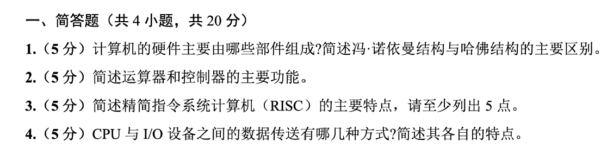

## 1

硬件组成：**运算器、控制器、存储器、输入、输出**。运算器和控制器合称位cpu

运算器负责算术运算和逻辑运算；控制器负责取指、译码并发出控制信号；存储器用于存放程序和数据；输入设备用于向计算机输入信息；输出设备用于输出处理结果。

诺依曼结构中，**程序和数据存放在同一个存储器**中，共用同**一套总线**；结构简单，但取指令和取数据可能产生冲突。
哈佛结构中，程序存**储器和数据存储器分开**，指令和数据可**分别访问**，速度较快，适合流水线和嵌入式系统，但结构较复杂。

## 2

运算器：算数运算、逻辑运算。核心部件ALU

控制器：控制计算机各部分协调工作。**取指令、分析指令、产生控制信号、控制指令执行顺序，并协调 CPU、存储器和 I/O 设备之间的数据传送**

## 3 

RISC，即精简指令系统计算机，主要特点有：

1. 指令系统简单，数量少
2. 指令格式规整，通常固定长度指令
3. 寻址方式少
4. 大多数指令速度快，一般一个周期可完成
5. Load/store结构，访存主要由专门的转入和存储指令完成
6. 通用寄存器多
7. 控制器多硬布线，执行效率高
8. 流水线技术方便
9. 更依赖编译器优化

## 4CPU 与 I/O 设备之间的数据传送方式及特点

1. 程序查询方式：cpu不断查询IO状态，准备好后再数据传输。特点：简单，单cpu反复等待，效率低
2. 中断方式：IO准备好后向cpu发出中断请求，cpu暂停当前程序，转去执行中断服务程序完成数据传送。特点：cpu不必一直等待，效率比查询方式高。担忧中断处理开销
3. DMA：由DMA控制器直接在IO和主存之间传送数据，cpu只负责初始化和结束处理。特点：适合大批量数据传送，cpu负担小速度快
4. 通道方式/IO处理机：由专门的通道或者IO处理机负责。特点：进一步减少cpu对IO干预，适合大型计算机系统。效率高硬件复杂


# **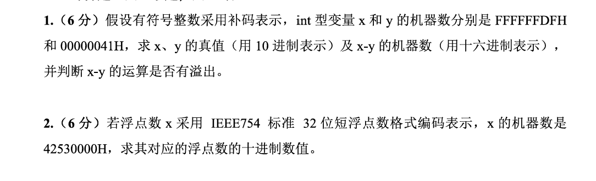**

##

**补码 -》 绝对值的原码**：正数原本，负数全部取反+1

**原码 -》 补码**：正数原本，负数除了符号位取反加一

x：直接取反加1得到绝对值原码，0000020H +1 = 0000021H = 0010 0001 = 33，所以x = -33

y：65（首位再最左侧已经是0了！！！）

x-y = -98

32位补码范围 -2^(31) 到 2^(31) - 1

#

0100 0010 0101 0011 0000 0000 0000 0000

s = 0

阶码:100 0010 0 = 4 + 128 = 真值 +127，真值 = 5

尾数：101 0011 0000 0000 0000 0000，1.101 0011 

11，01 00.11  = 2+16 +32 + 0.5 + 0.25 = 50.75

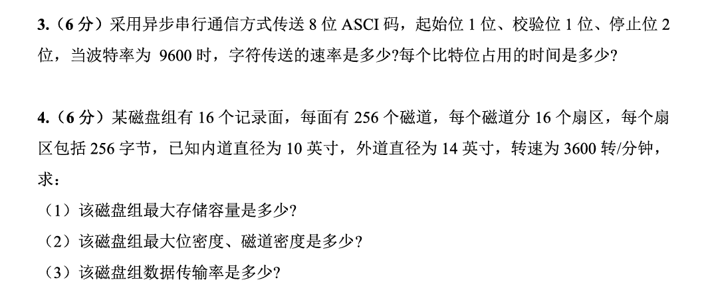

#

## 异步串行通信：发送方和接收方不共用统一时钟，而是提前约定好通信参数，比如波特率、数据位数、校验位、停止位，然后按“一个字符一帧”的方式传输。

典型的一帧： **起始位 + 数据位 + 校验位 + 停止位**

异步串行通信中，线路平时处于**空闲状态**。发送一个字符前，**先发一个起始位**，告诉接收方“我要开始发数据了”。接收方检测到起始位后，就按照约定好的**波特率**依次采样后面的**数据位、校验位和停止位**。

所以它叫“异步”，不是说双方完全没规则，而是说没有共享时钟线，靠起始位和约定速率来同步每个字符。

格式：空闲状态 → 起始位 → 数据位 → 校验位 → 停止位 → 空闲状态。**起、数、校、停**

**波特率**和字符速率：波特率表示每秒传多少个二进制位，单位常写作 bit/s。

如果一帧n位，字符传送速率 = 波特率 / 每个字符实际占用位数

不要只看 ASCII 是 8 位，就直接算 9600 / 

**字符传送速率 = 9600 / 12 = 800 字符/秒**

波特率是每秒几个bit，所以一个bit几秒就是1/波特率：1 / 9600 s = 0.00010417 s ≈ 104.17 μs

#

## 磁盘组：很多个磁盘盘片叠在一起，同轴旋转，每个可记录的盘面都有磁头。

结构：磁盘组 → 记录面 → 磁道 → 扇区 → 字节

记录面：一个盘片上下两面，但不一定每个面都能记录数据。

磁道：磁盘表明上的同心圆。一个圈一个磁道。**只分布在内道和外道的环形区域内部！**

扇区：每个磁道分成若干小段，每段是个扇区。是基本读写单位

最大存储容量直接全乘，

位密度：一英寸多少bit。每个磁道bit数/磁道周长。最大位密度在内圈，内圈最短。长度密度

磁道密度：半径方向上一英寸排多少条磁道。磁道密度 = 每面磁道数 / 磁道占用的半径宽度。都是长度密度

数据传输率：一秒传递多少数据。一秒转多少圈，每圈读多少数据。数据传输率 = 每磁道容量 × 每秒转数。磁盘转一圈时，磁头只能读到当前所在**那一条磁道上**的数据，不可能一转就把整个磁盘组所有记录面、所有磁道都读完。所以只×一个磁道的。每转经过磁头的数据量 = 一条磁道的容量

##

# 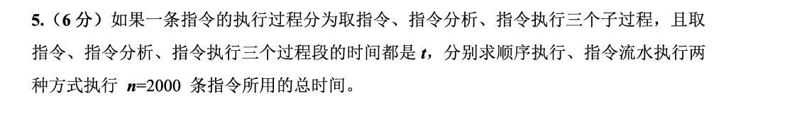

## 

顺序 6000t

流水：（3+2000-1）t = 2002t

# 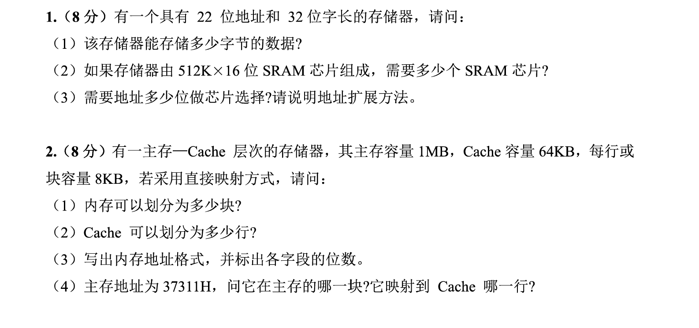

## 1

1. 2^22 * 4B(B是字节，bit是位)
2. 2^24/2^20 = 16（字节和位单位统一!!!!)
3. 目标：2^22 * 32位，sram：2^19*16位，所以每两个进行位扩展，用8个这样的进行字扩展。最高的三位进行选片。

地址扩展方法：低 19 位地址接到所有 SRAM 芯片的地址端；高 3 位地址经过 3-8译码器，选择 8 组中的一组。每组选中的同时有 2 片 SRAM 并联，组成 512K × 32位。


## 2

1. 2^7
2. 2^3
3. tag4|cache行号:3|块内地址13
4. 37311H / 2000H = 1BH 余 1311H,1BH mod 8

# 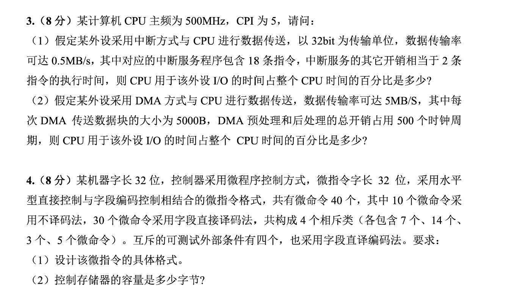

## 1.

### 知识

1. 主频：每秒有几个时钟周期。比如500MHz，表示每秒500*10^6。
2. cpi：平均每条指令需要几个时钟周期
3. 中断方式 I/O：外设需要传数据时，向 CPU 发中断请求；CPU 暂停当前程序，转去执行中断服务程序；执行完再返回原程序。
4. 中断次数：每秒要传多少数据 ÷ 每次中断能传多少数据
5. 每次中断 CPU 开销
6. CPU用于IO 占比 =每秒中断次数 × 每次中断开销时间

###

每条指令时间：5/500M

每秒要传的数据0.5
32bit = 4B
中断次数 = 0.5MB/s ÷ 4B = 125000 次/s
每次中断开销 = 18 + 2 = 20 条指令
每次中断时间 = 20 × 10ns = 200ns
总时间占比 = 125000 × 200ns = 0.025 = 2.5%（ns是负九次方）


转换后

DMA 次数 = 5MB/s ÷ 5000B = 1000 次/s
时钟周期 = 1 / 500MHz = 2ns
每次 DMA 开销时间 = 500 × 2ns = 1μs
每秒 DMA 开销时间 = 1000 × 1μs = 0.001s
占比 = 0.001 / 1 × 100% = 0.1%

## 2

机器指令
  ↓
微程序
  ↓
微指令
  ↓
微命令 / 微操作

、CPU 执行一条机器指令时，内部其实要完成很多很细的小动作，比如：

这些小动作叫做微操作，控制这些微操作的控制信号叫做微命令。

微指令：控制存储器里面放置的。微指令 = 操作控制字段 + 顺序控制字段

操作控制指令负责发出微指令，顺序控制字段负责决定下一个微指令去哪里去

水平型微指令：一条微指令中可以同时给出多个微命令。比如可同时表示PCout, MARin, Read, PC+1多个

优点

并行性强，
执行速度快，
控制信号直观，
译码少，

缺点

微指令字长较长，
控存容量可能较大，

垂直型：编码更紧凑但需要译码


1. 不译码法：不译码法就是一个微命令对应一个控制位。10 个微命令 => 10 位
2. 字段译码法：把一堆微命令分组，每组用二进制编码表示，再通过译码器翻译成具体微命令。类似压缩版微命令。

比如A, B, C, D, E, F, G，不译码

```
A B C D E F G
1 0 0 0 0 0 0   表示发出 A
0 1 0 0 0 0 0   表示发出 B
```

译码

```
000  表示不发微命令
001  表示 A
010  表示 B
011  表示 C
100  表示 D
101  表示 E
110  表示 F
111  表示 G
```

n 个互斥微命令，需要 k 位.要求必须互斥。
**满足 2^k >= n + 1**

优点：节省微指令位数。
缺点：需要译码器，速度略慢；同一字段内的微命令不能并行。

3. 混合编码

经常并行、不能随便合并的微命令，用直接控制法

互斥的一组微命令，用字段编码法

4. 相斥类：一组互斥的微命令。比如总线结构中，如果同一条内部总线一次只能由一个部件送数据，那么这些输出信号就是互斥的：
5. 字段编码要留“无操作”编码。就是所有微命令都不
6. 判断测试字段。微程序执行时，不一定永远顺序往下走。它也可能根据某些条件决定下一条微指令地址。。这些条件叫做可测试条件。微指令有字段专门表示要测试哪个条件。
7. 下地址字段：给出下一条微指令地址
8. 控制存储器容量：不是主存，专门放微程序。容量=控存字数 × 每条微指令长度。如果下地址字段k位，控存字数2^k,微指令长m位，
9. 机器字长和微指令字长：机器字长是 CPU 一次能处理的数据宽度，比如寄存器、ALU、数据通路宽度。微指令字长是控制存储器中一条微指令的长度。

微指令格式设计 = 控制信号怎么编码 + 下一地址怎么产生（顺序控制字段）

直接控制法：快，但费位
字段编码法：省位，但同字段不能并行
相斥类：适合放进同一个编码字段
判别测试字段：决定是否按条件改变微地址
下地址字段：决定控存最多有多少条微指令
控存容量：微指令条数 × 微指令字长

##


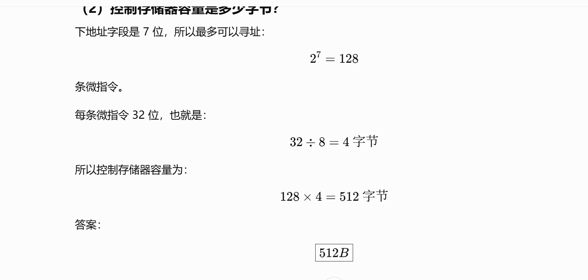

# 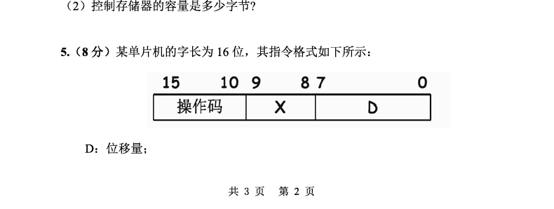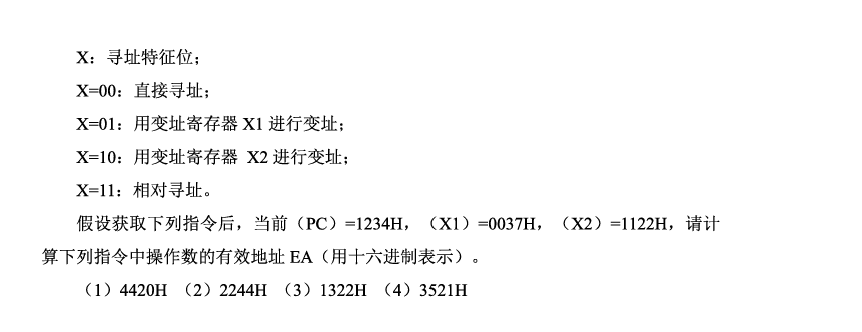

## 有效地址EA：操作数真正所在的内存地址。PC 是程序计数器，里面保存的是当前指令附近的地址。

##

4420H = 4420H = 0100 0100 0010 0000B

x=00

D = 20H

EA = 0020H

2.

2244H = 0010 0010 0100 0100B

X = 10
D = 44H

EA = X2 + D
   = 1122H + 0044H
   = 1166H

3.

1322H = 0001 0011 0010 0010B

X = 11
D = 22H

EA = PC + D
   = 1234H + 0022H
   = 1256H

4

3521H = 0011 0101 0010 0001B

X = 01
D = 21H

EA = X1 + D
   = 0037H + 0021H
   = 0058H

# 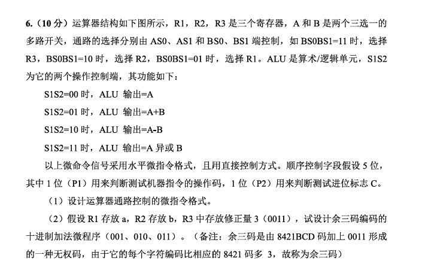 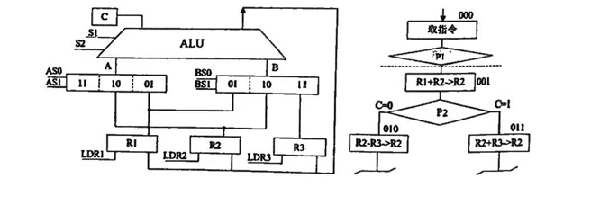

## 寄存器装入信号：LDR1，2，3.ALU结果送到公路，但是写入哪个需要对应位1

| AS0AS1 | BS0BS1 | S1S2 | LDR1 | LDR2 | LDR3 | P1 | P2 | 后继微地址 |
| ------ | ------ | ---- | ---- | ---- | ---- | -- | -- | ----- |
| 2位     | 2位     | 2位   | 1位   | 1位   | 1位   | 1位 | 1位 | 3位    |
