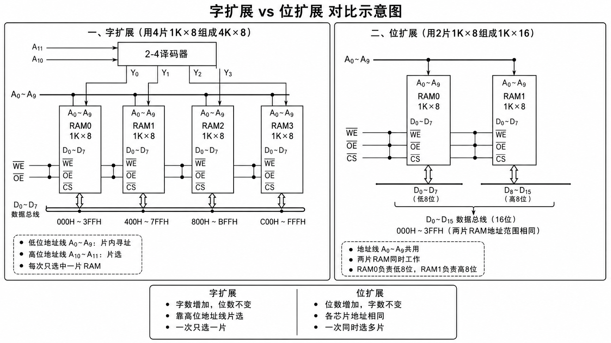

一. 判断题（共5题）
1
【判断题】
SRAM芯片工作时不需要刷新，DRAM芯片工作时需要刷新。

**SRAM**：

1. 全称：static ram：静态随机存取存储器
2. 存储单元：触发器
3. 特点：不断电数据就能稳定
4. 不需要刷新
5. 快
6. 缺点：集成度高

**DRAm**

1. dynamic ram：动态随机存取存储器
2. 单元：存储电荷表示0/1
3. 会漏电，电荷会消失
4. 需要定期刷新
5. 优点：集成度搞成本低容量大
6. 速度慢

我的答案：对
4.0分
AI讲解
2
【判断题】
主存容量字扩展时，需要将各芯片的数据线并联，地址线单独连接。

**一个存储器芯片 = 存储单元数目 \* 每个单元位数，一般就存储字数 × 存储字长，如1K × 8表示1k各存储单元，8表示每个单元8位**

字扩展：A11 和 A10 这两个高位地址负责选择访问哪一片 RAM；A0~A9 这 10 个低位地址负责选择这片 RAM 内部的哪一个存储单元。

位扩展：同时选中两片，取A0时同时选中两片中对应的单元，一片的8位作为低位，一片的作为高位

| 扩展方式 | 目的             | 地址线 | 数据线             | 片选线       |
| -------- | ---------------- | ------ | ------------------ | ------------ |
| 位扩展   | 增加每个字的位数 | 并联   | 分别接到不同数据位 | 通常同时选中 |
| 字扩展   | 增加存储字数     | 并联   | 并联到同一数据总线 | 分别片选     |

**字扩展**：多个芯片轮流作为不同地址范围的存储区域。

例如用若干个 1K × 8 芯片扩展成 4K × 8：

- 每个芯片内部仍然需要相同的地址线来访问芯片内的某个单元；
- 所以各芯片的低位地址线应该并联；
- 高位地址线经过译码器产生片选信号；
- 数据线接到同一组数据总线上，但同一时刻只能有一个芯片被片选。

**并联**：把所有的线链接到一个数据线上

字扩展时，各芯片同名数据线并联到同一组数据总线 D0~D7；CPU 给出地址后，高位地址经过译码器选中某一片芯片，低位地址选中该芯片内部的某个单元，被选中的芯片才把该单元的数据送到数据总线上。

低位地址线也并联到各芯片；但是高位地址线经过译码器产生片选信号，分别选中不同芯片。

我的答案：错
4.0分
AI讲解
3
【判断题】
RAM的读出是破坏性读出，因此读后需要再生。

| 类型       |                 是否破坏性读出 | 是否需要刷新/再生 |
| ---------- | -----------------------------: | ----------------: |
| SRAM       |                             否 |                否 |
| DRAM       | 一般读出后需恢复，且需定期刷新 |                是 |
| 磁芯存储器 |                             是 |                是 |

sram不是，dram和磁芯存储器是

我的答案：错
4.0分
AI讲解
4
【判断题】
存储器的存取时间是从存储器接收到读写命令开始到信息被读出或写入完成所需的时间。

**存取时间指从存储器收到一次读/写命令开始，到读出数据有效或写入操作完成为止所经历的时间。**

我的答案：对
4.0分
AI讲解
5
【判断题】
存储芯片的片选信号在字扩展中用于区分不同芯片的地址范围。

我的答案：对
4.0分
AI讲解
二. 单选题（共20题）
6
【单选题】
设机器字长为32位，一个容量为16MB的存储器，CPU按半字寻址，其可寻址的单元数是**\_\_\_**。

**可寻址单元数 = 存储器总容量/每个寻址单元大小**

| 寻址方式   | 每个地址对应大小 |
| ---------- | ---------------- |
| 按字节寻址 | 1 Byte           |
| 按半字寻址 | 半个字           |
| 按字寻址   | 一个字           |

半字 = 2byte

容量是 16 \* 2^20
A、
2∧22

B、
2∧21

C、
2∧24

D、
2∧23

我的答案：D
4.0分
AI讲解
7
【单选题】
设机器字长为64位，存储容量为128MB，若按字编址，它可寻址的单元个数是**\_\_**。

8

128/8
A、
32MB

B、
16M

C、
16MB

D、
32M

我的答案：B
4.0分
AI讲解
8
【单选题】
EPROM是指**\_\_**。

**EPROM：Erasable Programmable Read-Only Memory。紫外线可擦除可编程只读存储器**
A、
不可编程的只读存储器

B、
一次可编程的只读存储器

C、
电可擦除可编程的只读存储器

D、
紫外线可擦除可编程的只读存储器

我的答案：D
4.0分
AI讲解
9
【单选题】
某EPROM存储器容量为32K×16位，则其**\_\_**。

**地址线：用于选中某个存储单元**。N个地址线可以选中2^N个地址。32k = 2^15，所以15根

**数据线：传输一个存储单元中的数据**。16根

A、
地址线为32根，数据线为16根

B、
地址线为16根，数据线为15根

C、
地址线为16根，数据线为32根

D、
地址线为15根，数据线为16根

我的答案：D
4.0分
AI讲解
10
【单选题】
4个16K×8位的存储器芯片，可设计为**\_\_**容量的存储器。

A、
32K×8位

B、
16K×16位

C、
32K×16位

D、
8K×16位

我的答案：C
4.0分
AI讲解
11
【单选题】
DDR SDRAM 相比 SDRAM 主要改进在**\_\_\_\_**。

**SDRAM：Synchronous Dynamic Random Access Memory，同步动态随机存储器。**同步指的是读写擦欧总和系统时钟同步

**DDR SDRAM**：Double Data Rate。一个时钟周期传两次数据。上升沿一次，下降沿一次

A、
使用了双倍数据率技术，在每个时钟周期的上升沿和下降沿传输数据

B、
不需要刷新电路

C、
更高的电压工作

D、
更高的存储密度

我的答案：A
4.0分
AI讲解
12
【单选题】下列哪种芯片结构中包含了刷新电路？
A、
Flash：断电后仍可以保存
B、
SRAM
C、
**DRAM**
D、
ROM：只读
我的答案：C
4.0分
AI讲解
13
【单选题】下列各类存储器中，不采用随机存取方式的是**\_\_**。
A、
DRAM
B、
EPROM
C、
SRAM
D、
**CD-ROM：光盘存储器，访问依赖机械寻道，补可以按地址访问\*\***cd/光盘/磁盘都不行\*\*

**DRAM、SRAM、ROM、EPROM、EEPROM 一般都按随机存取处理**

我的答案：D
4.0分
AI讲解
14
【单选题】磁盘属于**\_\_\_\_**类型的存储器。
A、
顺序存取存储器（SAM）：必须按顺序访问，**磁带**
B、
只读存储器（ROM）
C、
随机存取存储器（RAM）
D、
**直接存取存储器（DAM）**：线定位到某一区域，再顺序读写，磁盘光盘

1. 看到“磁盘” → 想到“磁道、扇区、寻道定位” → 属于“直接存取”
2. 看到“磁带” → 想到“从前往后顺序读” → 属于“顺序存取”
   我的答案：D
   4.0分
   AI讲解
   15
   【单选题】下列哪种存储器的结构中包含了 NOR 闪存和 NAND 闪存？
   A、
   DRAM
   B、
   ROM
   C、
   SRAM
   D、
   Flash Memory（闪存）

flash memory：**非易失**

- 断电后不丢失
- 有nor flash：支持随机读取，读取速度快
- 有nand flash：容量大、成本低、适合块读写
  我的答案：D
  4.0分
  AI讲解
  16
  【单选题】某容量为256MB的存储器由若干4M×8位的DRAM芯片组成，该DRAM芯片的地址引脚和数据引脚总数**\_\_**。

4M = 4\*2^20 = 2^22 ->理论地址位数

**特殊的，DRAM地址引脚数要除以2**

A、
19
B、
30
C、
22
D、
36
我的答案：A
4.0分
AI讲解
17
【单选题】下列哪种存储器与 CPU 的耦合度最高？

| 层次  | 速度                       | 容量           | 与 CPU 耦合度 |
| ----- | -------------------------- | -------------- | ------------- |
| Cache | 很快                       | 较小           | 最高          |
| 主存  | 较快                       | 较大           | 较高          |
| 辅存  | 慢                         | 很大           | 低            |
| ROM   | 只读存储器，常用于固化程序 | 视具体用途而定 | 不如 Cache    |

A、
主存
B、
辅存
C、
**Cache**
D、
ROM
我的答案：C
4.0分
AI讲解
18
【单选题】
和外存储器相比，内存储器的特点是**\_\_**。

| 项目         | 内存储器 | 外存储器 |
| ------------ | -------- | -------- |
| 容量         | 较小     | 较大     |
| 速度         | 快       | 慢       |
| 成本         | 高       | 低       |
| 是否断电保存 | 通常不能 | 可以     |

内：**小快高不断电**，

外：大慢低可以

A、
容量小，速度快，成本低

B、
容量大，速度快，成本低

C、
容量大，速度慢，成本高

D、
容量小，速度快，成本高

我的答案：D
4.0分
AI讲解
19
【单选题】
某计算机字长为32位，其存储容量为4GB，若按双字编址，则它的寻址范围是**\_\_\_**。

4b

4/8

A、
1G

B、
2G

C、
0.5G

D、
4G

我的答案：C
4.0分
AI讲解
20
【单选题】DRAM的刷新是以**\_\_**为单位的。

**DRAM行刷新**

A、
存储单元
B、
**行**
C、
存储字
D、
列
我的答案：B
4.0分
AI讲解
21
【单选题】下列哪种方式是同时增加存储器的深度和宽度？

**存储单元**：深度

**位数**：宽度
A、
模块扩展
B、
字扩展
C、
字位扩展
D、
位扩展
我的答案：C
4.0分
AI讲解
22
【单选题】
若RAM中每个存储单元为16位，则下面叙述中正确的**\_\_**。

A、
数据线是16位

B、
地址线是16位

C、
控制线是16位

D、
指令长度是16位（cpu决定）

我的答案：A
4.0分
AI讲解
23
【单选题】
存储器的存储周期是指**\_\_**。

**存取时间：指从启动一次存储器访问，到完成该次读出或写入所需要的时间。**

**存储周期：指存储器连续进行两次读/写操作所允许的最短时间间隔。\*\***它通常大于或等于存取时间，因为一次访问完成后，存储器可能还需要恢复、刷新、稳定等时间，才能进行下一次访问。\*\*
A、
存储器的读出时间

B、
存储器的写入时间

C、
**存储器进行连续读或写操作所允许的最短时间间隔**

D、
存储器进行一次读或写操作所需的平均时间

我的答案：C
4.0分
AI讲解
24
【单选题】
下列存储器中，在工作期间需要周期性刷新的是**\_\_**。

A、
FLASH

B、
**SDRAM（Synchronous DRAM，同步动态随机存储器，属于DRAM要刷新**）

C、
ROM

D、
SRAM

我的答案：B
4.0分
AI讲解
25
【单选题】
下列说法正确的是**\_\_**。

A、
EPROM只能改写一次，故而不能作为随机存储器（能写多次，PROM只能写一次）

B、
EPROM是可改写的，故而可以作为随机存储器（擦除需要紫外线很麻烦）

C、
EPROM是不可改写的，故而不能作为随机存储器

D、
EPROM是可改写的，但不能作为随机存储器

我的答案：D
